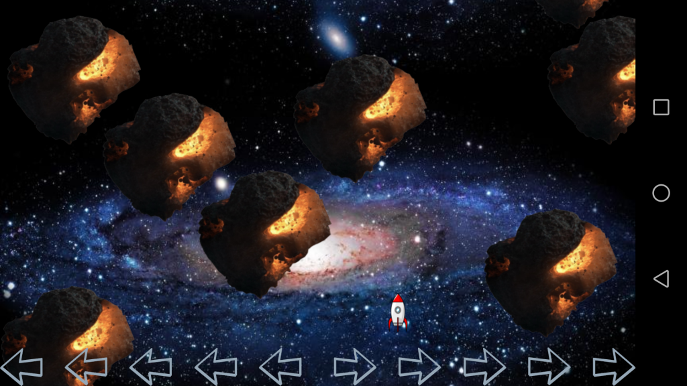
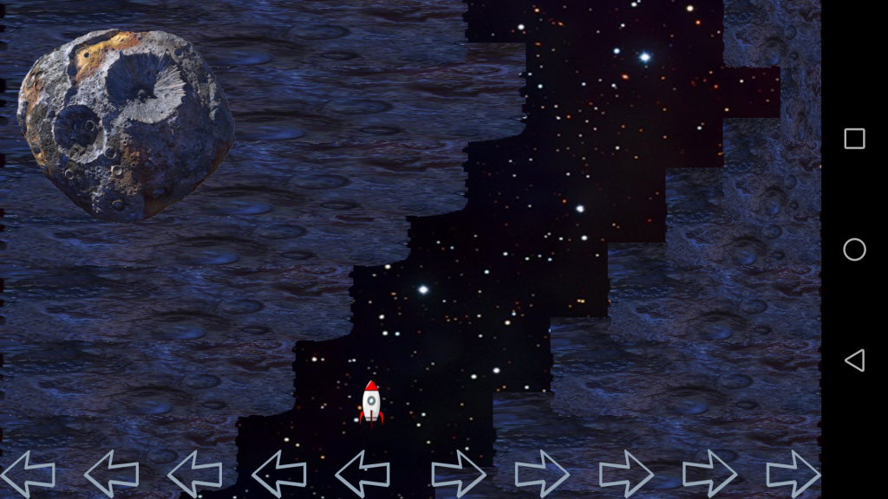

# Galaxyrun - Android game

Simple Android game written in Python based on kivy framework. Game runs on Android devices and Linux PCs. 

This is simple fullscreen GUI touch game. Running on Desktop PC and Android.

### Requirements:
* Complete list will be done once app is finnished
* Python 2.7
* Kivy framework

### Run

#### Run on Desktop:

`python main.py`

### Build Android (.apk) package and deploy into connected HW device (mobile phone)

* Note: buildozer SW packaging tool must be installed

#### Build Android package
`buildozer android debug`

#### Deploy Android App onto connected Android mobile phone
`buildozer android deploy`

### Availability
You can find this App on Android Play Store under name 'GalaxyRun demo'

